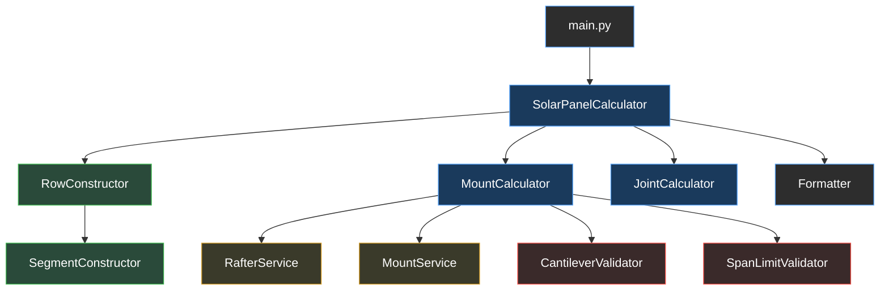

## 🚀 Key Features

● Mount Calculation Engine: Automatically determines support positions by aligning panels with vertical rafters (16-unit spacing).

● Structural Constraint Validation: Implements rigorous engineering rules, including:

● Edge Clearance: Minimum 2-unit offset from panel boundaries.

● Cantilever Limits: Maximum 16-unit overhang for continuous segments.

● Span Optimization: Ensures distance between supports never exceeds 48 units.

● Smart Joint Logic: Identifies horizontal and vertical connections between adjacent panels, supporting multi-row shared joints (up to 4 panels) to minimize hardware usage.

● Modular Architecture: Built using SOLID principles for high extensibility and maintainability.
## Architecture


## How to Setup and Run the Application

### 1. Clone the Repository
```bash
git clone https://github.com/onyevyerov/solar_panel_calculator
cd solar_panel_calculator
```
### 2. Set up the Virtual Environment
```
# Create (for all systems)
python -m venv venv

# Activation (Linux/macOS)
source venv/bin/activate

# Activation (Windows)
.\venv\Scripts\activate
```
### 3. Install Dependencies
```bash
pip install pytest
```
### 4. Customizing the Input File Path (Modifying `main.py`)

To run the calculation using your own data file, you must modify the path string within the `load_panels_from_file` call inside the `main()` function in `main.py`.

By default, the path is set to `"examples/sample_input.json"`.

```python
# In main.py (inside the main() function)
def main() -> None:
    # ----------------------------------------------------------------------------------
    # CHANGE THIS PATH to point to your custom data file (e.g., "my_data/custom.json")
    panels = load_panels_from_file("examples/sample_input.json")
    # ----------------------------------------------------------------------------------
    
    result = SolarPanelCalculator(panels).calculate()
    print(result)
```

### 5. Running the Application
Execute the main.py file from the root directory after setting your desired input path:
```bash
python main.py
```

### 6. How to Execute the Test Suite to Verify the Results
To verify the correctness and structural integrity of the calculation logic, run the test suite using pytest.
```bash
pytest
```
